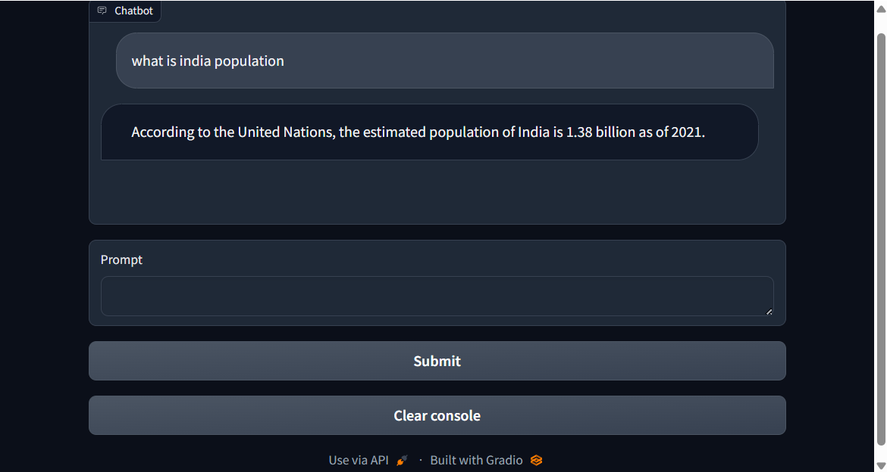

## Development and Deployment of a 'Chat with LLM' Application Using the Gradio Blocks Framework

### AIM:
To design and deploy a "Chat with LLM" application by leveraging the Gradio Blocks UI framework to create an interactive interface for seamless user interaction with a large language model.

### PROBLEM STATEMENT:
To design and deploy a "Chat with LLM" application by leveraging the Gradio Blocks UI framework.

### DESIGN STEPS:

#### STEP 1:
Load environment variables and initialize the Hugging Face FalconLM-instruct endpoint using the text_generation.Client to handle prompt-based text generation.

#### STEP 2:
Create a Gradio interface to generate completions based on user input and a slider to control max_new_tokens dynamically.

#### STEP 3:
Design a Gradio chatbot using message formatting to maintain history and return contextual responses, enabling continuous dialogue with FalconLM.

### PROGRAM:
```
import os
import io
import IPython.display
from PIL import Image
import base64 
import requests 
requests.adapters.DEFAULT_TIMEOUT = 60

from dotenv import load_dotenv, find_dotenv
_ = load_dotenv(find_dotenv()) # read local .env file
hf_api_key = os.environ['HF_API_KEY']

# Helper function
import requests, json
from text_generation import Client

#FalcomLM-instruct endpoint on the text_generation library
client = Client(os.environ['HF_API_FALCOM_BASE'], headers={"Authorization": f"Basic {hf_api_key}"}, timeout=120)

prompt = "Has math been invented or discovered?"
client.generate(prompt, max_new_tokens=256).generated_text

#Back to Lesson 2, time flies!
import gradio as gr
def generate(input, slider):
    output = client.generate(input, max_new_tokens=slider).generated_text
    return output

demo = gr.Interface(fn=generate, 
                    inputs=[gr.Textbox(label="Prompt"), 
                            gr.Slider(label="Max new tokens", 
                                      value=20,  
                                      maximum=1024, 
                                      minimum=1)], 
                    outputs=[gr.Textbox(label="Completion")])

gr.close_all()
demo.launch(share=True, server_port=int(os.environ['PORT1']))

def format_chat_prompt(message, chat_history):
    prompt = ""
    for turn in chat_history:
        user_message, bot_message = turn
        prompt = f"{prompt}\nUser: {user_message}\nAssistant: {bot_message}"
    prompt = f"{prompt}\nUser: {message}\nAssistant:"
    return prompt

def respond(message, chat_history):
        formatted_prompt = format_chat_prompt(message, chat_history)
        bot_message = client.generate(formatted_prompt,
                                     max_new_tokens=1024,
                                     stop_sequences=["\nUser:", "<|endoftext|>"]).generated_text
        chat_history.append((message, bot_message))
        return "", chat_history

with gr.Blocks() as demo:
    chatbot = gr.Chatbot(height=240) #just to fit the notebook
    msg = gr.Textbox(label="Prompt")
    btn = gr.Button("Submit")
    clear = gr.ClearButton(components=[msg, chatbot], value="Clear console")

    btn.click(respond, inputs=[msg, chatbot], outputs=[msg, chatbot])
    msg.submit(respond, inputs=[msg, chatbot], outputs=[msg, chatbot]) #Press enter to submit

gr.close_all()
demo.launch(share=True, server_port=int(os.environ['PORT4']))

gr.close_all()
```

### OUTPUT:


### RESULT:
Thus, The designing and deploying of a "Chat with LLM" application by leveraging the Gradio Blocks UI framework is executed successfully.
